# Plankton segmentation: A transfer learning and active learning approach

## Quick presentation

This project addresses the challenge of separating plankton from noisy backgrounds in microscopy images (ZooScanNet dataset). The goal is to generate precise **binary masks** (Object vs. Background) despite a domain shift and a scarcity of annotations.

**Key points:**
*   Designed a **Transfer Learning** strategy from a clean dataset (Pelgas) to a noisy one (ZooScanNet).
*   Implemented a **Human-in-the-loop Active Learning** pipeline to iteratively improve the binary masks with minimal manual effort.
*   Implemented a uncertainty sampling strategy inspired by the paper [Active learning for medical image segmentation with stochastic batches](https://arxiv.org/abs/2301.07670)

## Full presentation

Working on the [ZooScanNet](https://www.seanoe.org/data/00446/55741/) planktons dataset, I needed to get masks separation planktons from noise and background. 

Difficulties:
- Traditional image processing techniques were not easy to implement because of noise in the background
- Using pre-trained models for segmentations like SAM was not successful as these models are usually trained on datasets such as ImageNet and that the domain shift is too important
- From-scratch manual annotation is possible but time consuming (84 classes in the dataset)

To answer the problem I made my own approach reducing the difficulties linked to the nature of the dataset:

### Transfer Learning

To reduce the difficulty of manual image annotations I trained a model on a dataset with a cleaner background ([Pelgas Dataset](https://www.seanoe.org/data/00829/94052/)).

Working on a cleaner dataset allowed to extract some masks using a traditionnal image processing method. 

The idea is to hope that a model trained on this dataset can perform good enough on the ZooScanDataset and allow me get a starting point for manual annotation which will save me a lot of time. 

#### Phase 1: Annotation of a validation dataset

For the next steps, I needed to annotate a validation set from the ZooScanNet dataset so that I could measure how good my future models perform. 

A custom annotation tool was built using Napari to manually annotation around 70 images from the goal dataset. 

#### Phase 2: Find an architecture and hyperparameters suitable for generalization

The first step in my approach corresponds to finding an architecture and hyperparamters which will allow a model trained on PELGAS to be good enough for inference on the ZooScanNet dataset. It also will be a good baseline. 

Since training is fast, I experimented on two architectures and 12 combinations of hyperparameters in a gridsearch:

- Model 1: backbone: resnet34 + UNet
- Model 2: backbone: resnet34 + DeepLabV3Plus

Among the hyperparaters, I included the decision to freeze or unfreeze the backbone. 

Unsurprisingly, simpler and unfrozen models performed better on my test set. This is due to:
- The backbone being pretrained on ImageNet, and thus being able to extract features meaningful for a different yet wider domain of images;
- More complex models overfitting faster on the train set

Overall, all models tend to overfit after a few epochs which is also not surprising. 

Best model reached 82% Dice score on the test set ; and a 0.162 TwerskyLoss ($\alpha=0.7$, $\beta$=0.3$). This is a promissing result.

However, the segmentation on ZooScanNet unlabelled images with this unaugmented training is really bad :

  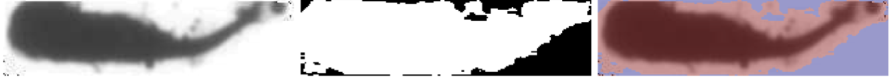
  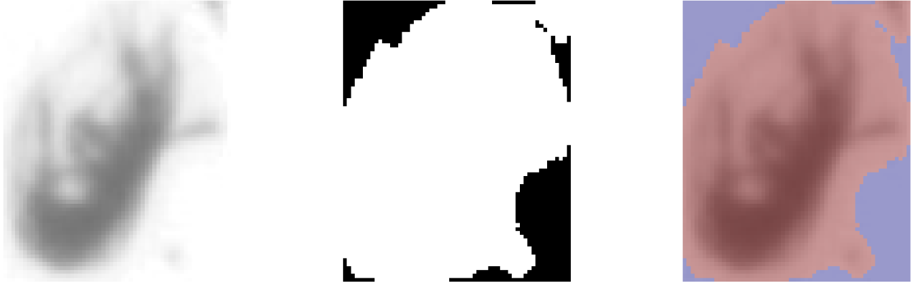
  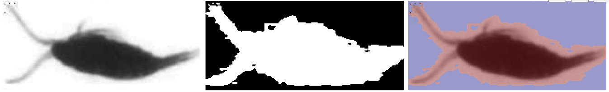

Oversegmentation and noise are included, making this approach worse than a simple image processing pipeline.

#### Phase 3: Find a set of augmentations to improve generalization

The previous training were done with only very basic transformations. It is highly predicatible that heavier augmentations will result in better performances on the ZooScanNet dataset. To test this hypothesis and find the best set of augmentations, I followed advices from the [Albumentations documentation](https://albumentations.ai/docs/3-basic-usage/choosing-augmentations/) and made a set of 5 augmentations compositions.

These compositions are:

- 'basic': Resize + HorizontalFlip + VerticalFlip + Rotation
- 'occlusion': All of the above + CoarseDropout
- 'affine': All of the above + replacing Rotation by Affine augmentations
- 'domain' All of the above +  GridDistortion + RandomGamma + ISONoise + Blurring + Downscale
- 'specialized': All of the above + FDA/HistogramMatching

The gain from this strategy is not great **on paper**. Gains are low but visible going from basic to occlusion and from occlusion to affine, however the more risky approaches 'domain' and 'specialized' (FDA) only made it more difficult for the model to fit the train data without any gain on the test data:

  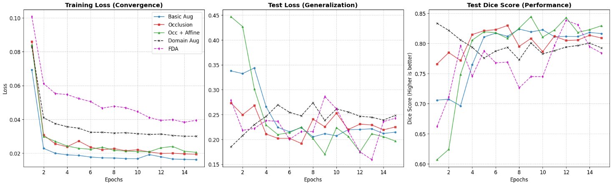

Here are some results for unseen pictures from the 'affine' model:

  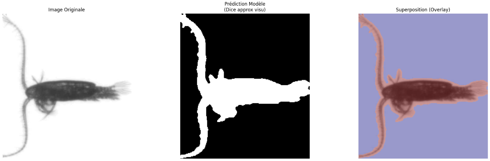
  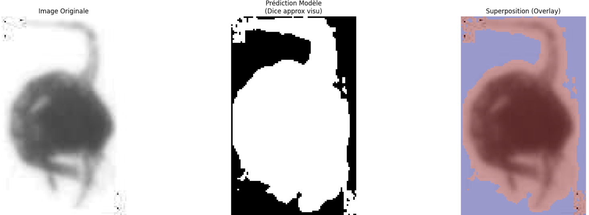
  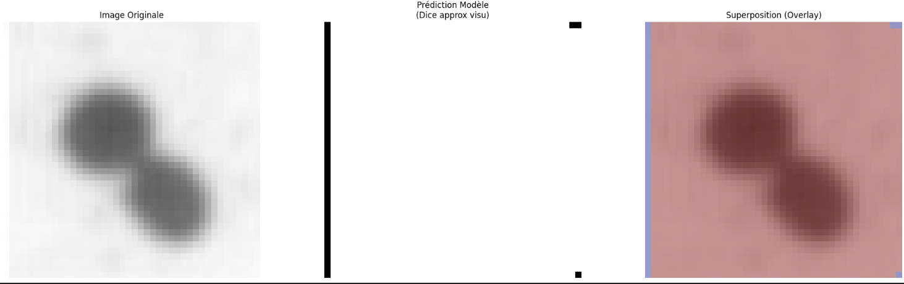

##### "Sometimes metrics are just... metrics"

Even though the dice score and the losses looked worse for the 'specialized' model, the gains are actually great. This shows that metrics must be chosen really carefully and analyzed for what they are. **Segmentations from this model actually look much better**:

  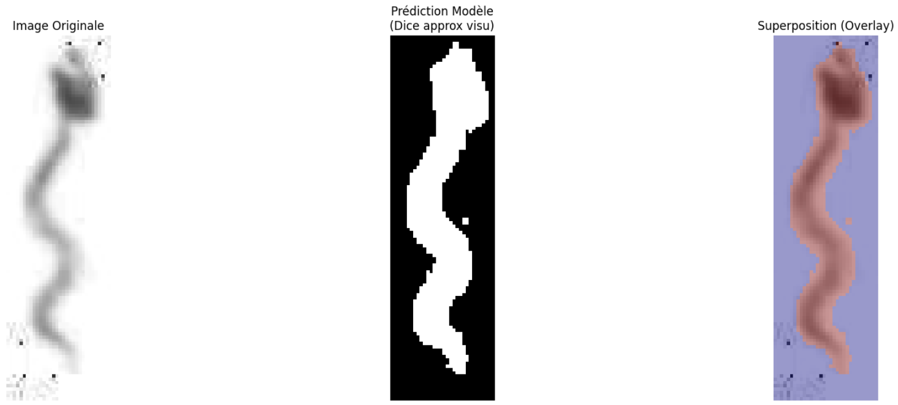
  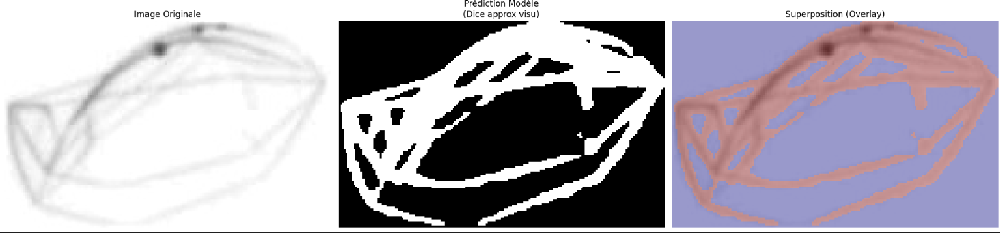
  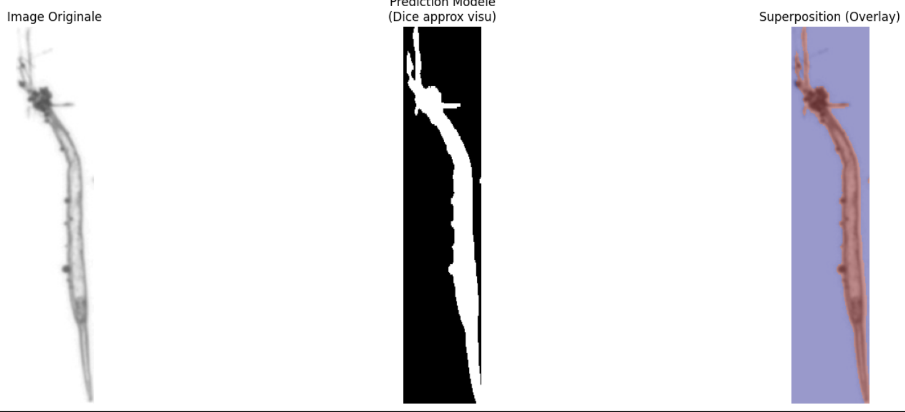

*Note: The two last models with higher augmentations were trained with an unfrozen backbone*

### Active Learning

At this point, I had a decently working model but there were still a lot of inconsistancies when infering on the ZooScanNet dataset. These inconsistancies were not acceptable for the intended application. Since annotation was expensive (I didn't have a lot of time to spend on it), I opted for an active learning approach.

Challenge: Lack of diversity in the sampling of images to label: Prototyping this active learning phase showed me that the basic uncertainty sampling stategy lacked a lot of diversity (mostly showing eggs)

To solve the problem, I made a method inspired by the paper [Active learning for medical image segmentation with stochastic batches](https://arxiv.org/abs/2301.07670). The idea is:

- Instead of computing the uncertainty score on images individually, compute it on batches made from a random sampling in the available unlabelled images
- Use TTA to estimate the uncertainty better

#### Configuration

For the trainings, I will use the 'specialized' augmentations and exactly the same configuration as the best model trained with them until now. Train dataset will be composed of the 4482 samples from the Pelgas dataset + $20 \times$ (number of iterations done) samples from the ZooScanNet dataset. The samples will be sampled using a weighted sampler, with weights $10/times$ bigger for samples annotated by hand. 

Starting from the third iteration of annotation, the amount of epochs used for training was increased by $2$ at each new iteration and the resize was augmented by $16$ for both width and height. This decision was taken as I realized that most probably, very thin lines were not only too difficult to segment for the model and were compressed sometimes so much that the annotated mask disappeared for these zones.*

Increasing these parameters gradually and not just once and for all allowed me to make the training phases much shorter. The model didn't really have enough clean annotations to be trained on to really be good at segmenting more difficult features. 

#### Observations

At the beginning, the algorithm was too bad to really be helpful during the annotation phase (although, good enough for the simplest classes). The active learning algorithm worked so great that I could see clearly huge improvements at every steps, even though the amount of manually annotated images was very small ($20$ to $100$ during the first $5$ iterations vs. $4482$ from Pelgas):

- During the 1st and 2nd annotation phases, I manually reannotated $19/20$ images
- During the 3rd annotation phase, I manually reannotated $17/20$ images
- During the 4rd and 5th annotation phase, I manually reannotated $16/20$ images
- During the 6th annotation phase, I manually reannotated $13/20$ images
- During the 7th annotation phase, I manually reannotated $10/20$ images, **dividing by $2$ the amount of time spent for reannotation**

Because of the change of parameters at each iteration (*), it is not possible to provide a curve to see how the training improved iteration by iteration. I stopped after $10$ iterations as the "annotation budget" (i.e. my will to spend more time annotating) ended. 

#### Phase 4: Final training

The final training was done with the same parameters. The total number of manual annotations on ZooScanNet was $200$ annotation done during the previous phase + $200$ annotations done during the prototyping of my scripts (with a much less efficient approach, e.g. uncertainty sampling done with a classic approach). 

The hyperparameters used were:

- batch size: $8$ (divided by $2$ vs. phase $3$ so that batches could fit on my $8$ GB VRAM)
- image resize: $512$

### Limitations:

- The choice of the architecture is not optimal: the dimensions of images are an a very wide interval, a transformer would be probably more efficient. The chosen architecture was made to allow me to train my models and iterate fast as well as make everything fit on an 8 GB RTX 2000;
- Some images are so small/noisy that it is sometimes very difficult even for a human to make a mask;

  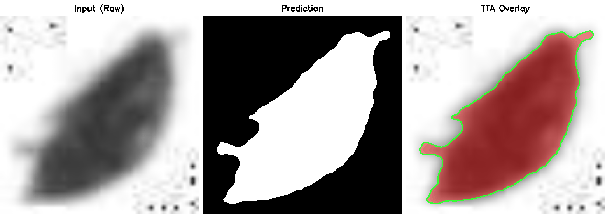

